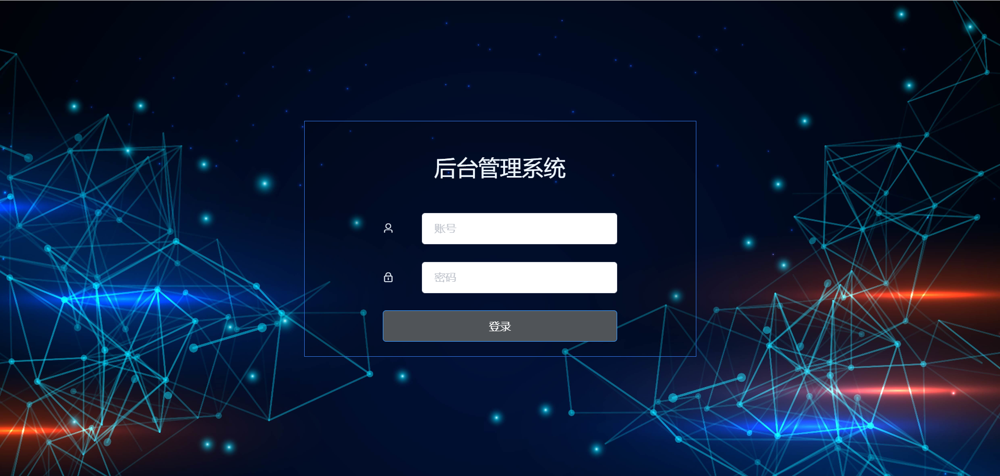
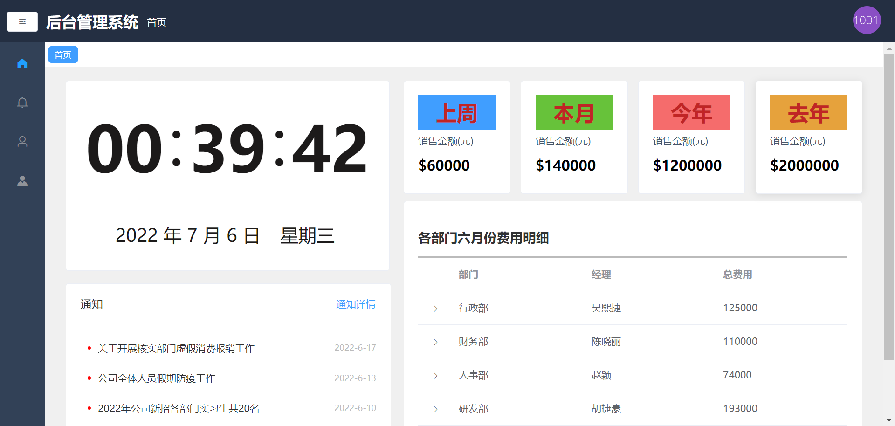
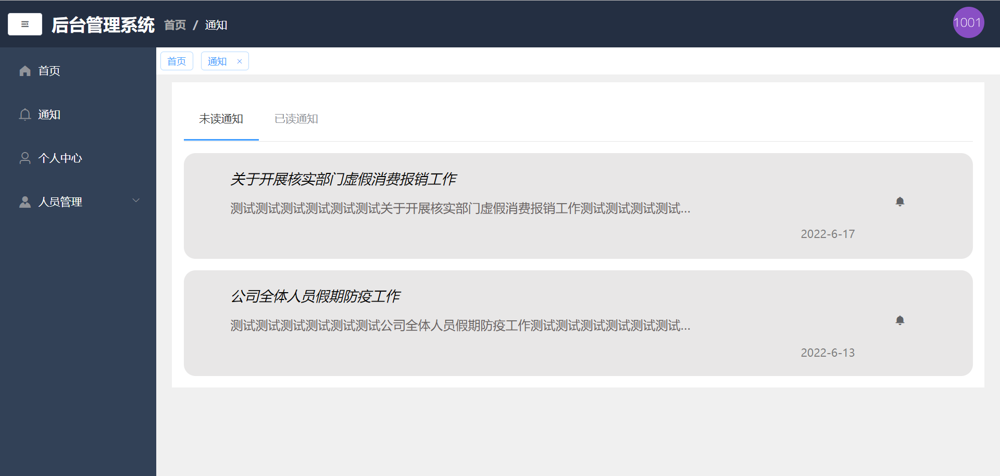
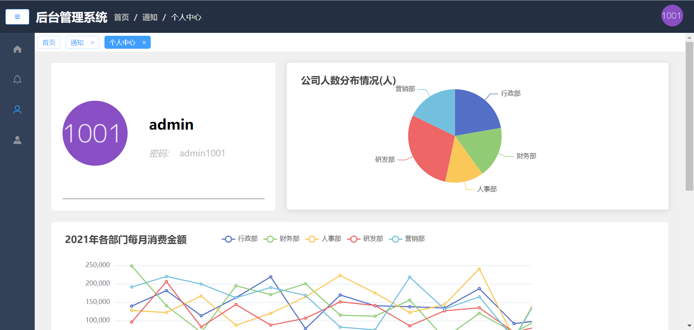
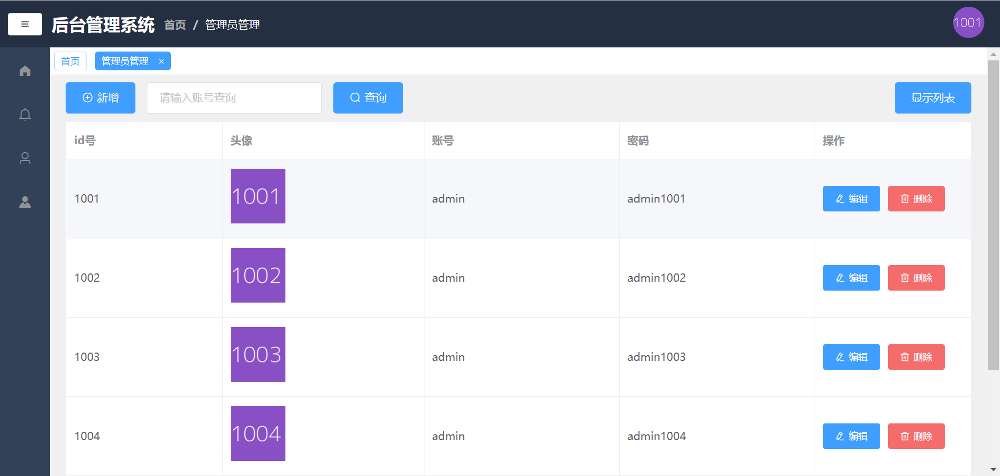
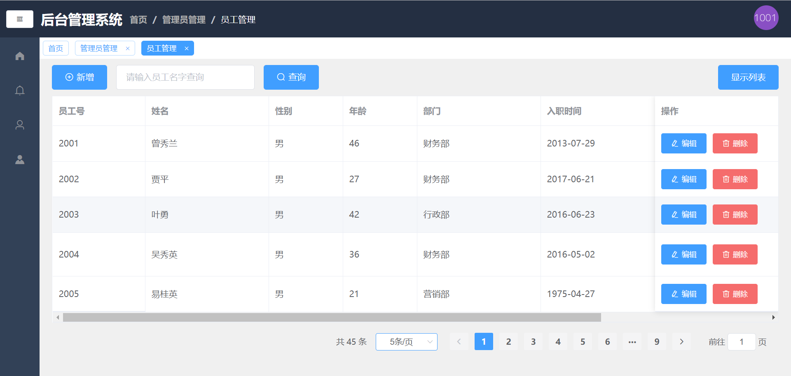

# 公司后台管理系统

### 介绍
------------------------
前端vue2项目-公司后台管理系统

### 技术栈
------------------------
vue2 + vuex + vue-router + echarts + elementUI + axios + mockjs

### 目录结构
------------------------
```bash
├── /node_modules/          # 项目构建相关配置
├── /public/                # 公用文件
├── /src/                   # 源码目录
│ ├── /api/                 # 请求接口
│ ├── /assets/              # 组件静态资源(css文件和图片)
│ ├── /components/          # 公共组件
| ├── /mock/                # 模拟数据
│ ├── /router/              # 路由配置
│ ├── /store/               # 状态管理器
│ ├── /views/               # 路由组件(展示页面)
│ ├── App.vue               # 组件入口
│ └── main.js               # 程序入口
├── /static/                # 非组件静态资源
├── .babel.config.js        # balel转换器的配置文件
├── .jsconfig.json          # babel解析js的配置
├── .package-lock.json      # 小模块的版本记录
├── .package.json           # 项目依赖
└── README.md               # 项目文档
├── .vue.config.js          # 配置文件
└── yarn.lock               # 构建依赖关系树
```

### 页面展示
------------------------
>登录


>首页


>通知


>个人中心


>管理员管理


>员工管理


### 功能
-   [x] 登录/退出
-   [x] 路由拦截
-   [x] Element-UI
-   [x] Tab 选项卡
-   [x] 二级菜单
-   [x] Echarts图表展示
-   [x] 信息通知的未读已读标记
-   [x] 表格
-   [x] 表单
-   [x] 管理员/员工的基础的CURD操作

### 运行程序
------------------------
1.  项目地址：(克隆/下载)
```
git clone git@github.com:SupernaturalDeveloper/backstage-supporter-pro.git
```
2.  进入模板目录
```
cd backstage-supporter-pro
```
3.  初始化
```
npm install
```
4.  热加载
```
npm run serve
```
5.  浏览器访问
```
http://localhost:8080
```
6.  管理员登录
```
账号：admin
密码：admin1001
```

